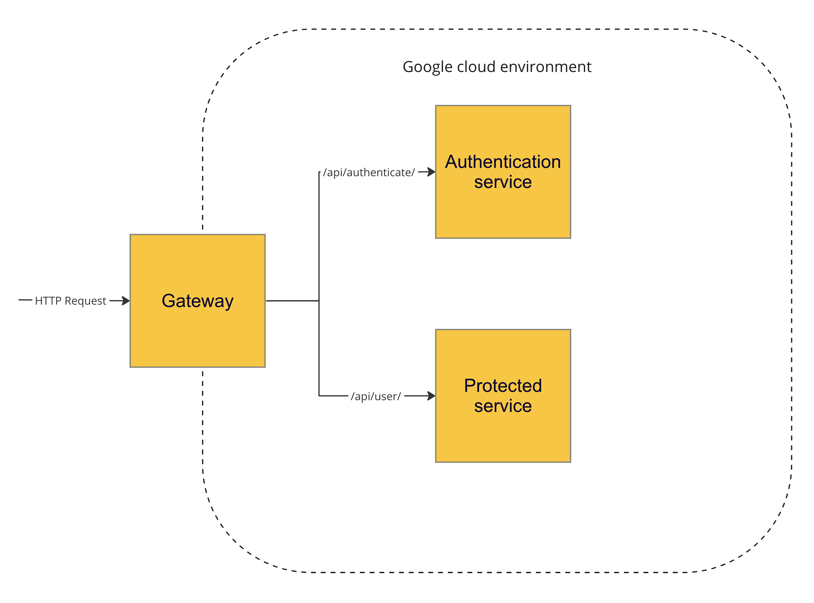
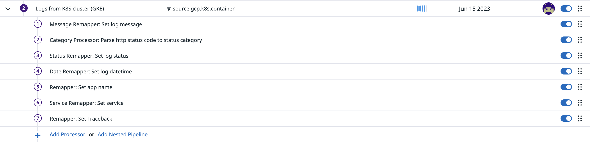
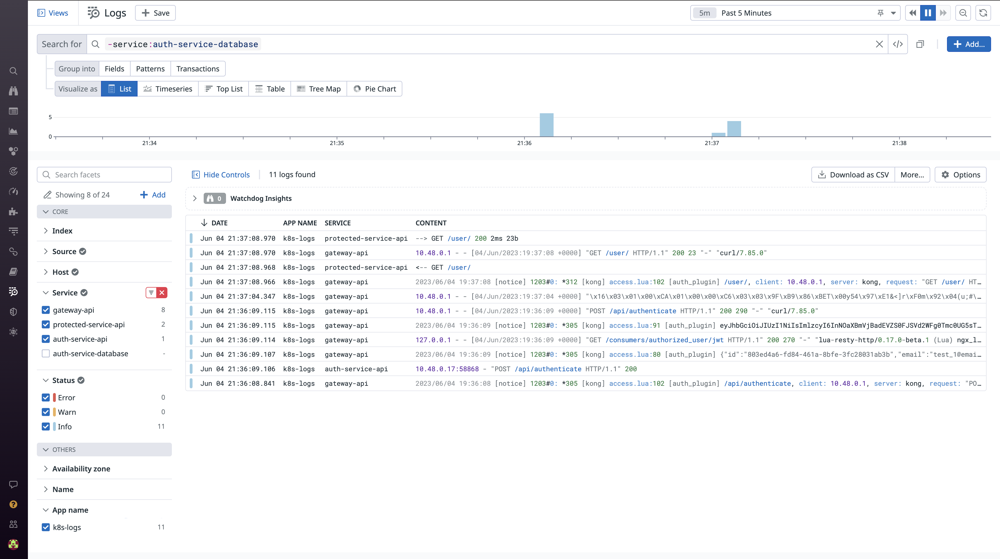

# Retrieving logs from k8s cluster
This repository represents kubernetes cluster deployed to Google Cloud. The cluster contains 3 services: Gateway, Authentication service and Protected rest API.



Authentication service and Protected rest API aren't directly available from the outside. Only gateway is accessible to external user and all http requests go through it.
Gateway determines, if a user is authenticated and has access to protected service and if so, then forwards original request to this.
Also, gateway can redirect user's request to authentication service, if request is made to certain path. Read more about purpose and settings of gateway in the related folder.

Logs from all k8s services are collected and sent to the DataDog.

## Kubernetes cluster
All k8s manifests are placed in the `k8s` folder, so you can overview what cluster represents in details.
Also, check each service folder (`gateway`, `auth_service` and `protected_service`) to know what services are deployed and what they do.

You can use `kubectl apply -f ./manifest_file.yml` to deploy each service separated.
However, you can use `Helm` to deploy entire cluster with one command.
Helm's manifests are placed in `helm-k8s-logs` folder.
Helm is package manager for kubernetes.
Read more about Helm in its [docs](https://helm.sh/).

You can deploy this cluster to any cloud provider, however, it has already been adjusted to be deployed to Google cloud.
 
### Building images
You need to build and push image of each service to Google Artifact Registry, so k8s will be able to use them when it will deploy services to the cluster.
Read how to do it [there](https://cloud.google.com/build/docs/build-push-docker-image).

After images are deployed, set appropriate values to `spec.template.spec.containers.image` property in service manifests.

### Deploy services to cluster
You need to get access to your cluster in Google cloud to deploy created service images.
You can read how to do it [there](https://cloud.google.com/kubernetes-engine/docs/how-to/cluster-access-for-kubectl).

After you get access, you can deploy services separately by `kubectl` command, or you can use `helm` to deploy all services as release.

Run `kubectl get svc` command to get list of deployed services.
The `gateway-api` service should have external api address, that can be used to make http requests to the cluster.

### Configure authentication service
Get id of pod that authentication service is deployed on:
```
kubectl get pods
```

Then, execute these commands on that pod to apply migrations:
```
kubectl exec -it {POD_ID} bash -c "alembic upgrade heads"
```
and create a new user:
```
kubectl exec -it {POD_ID} bash -c "python add_user.py --username user_1 --password 1234 --email user_1@email.com"
```

### Make requests to the cluster
At first, you need make request to authenticate a user:
```
curl -X POST 'http://{CLUSTER_HOST}:{CLUSTER_PORT}/{AUTH_PATH}' -H 'Content-Type: application/json' --data '{"username": "test_1", "password": "123"}'
```

After, you can make request to the protected endpoint using gotten JWT token:
```
curl -X GET -H "X-SERVICE-EXCHANGE-KEY:Bearer SERVICE_EXCHANGE_SECRET_KEY" -H "Authorization:Bearer {JWT_TOKEN}"  https://127.0.0.1:8000/api/user/
```

Response should contain email of authenticated user.

_Go to the gateway folder to know about `AUTH_PATH`, service exchange key and others parameters._

## Logging
To get logs from deployed services you need to have account in the DataDog and create logs forwarding in you Google Cloud Console.
Also, you need to create appropriate logs pipeline in you DataDog profile.

You can read [there](https://docs.datadoghq.com/integrations/google_cloud_platform/#create-a-cloud-pub-sub), what need to create in Google Cloud to forward logs to Datadog.

However, there is IaC configuration of required Google Cloud modules in terraform folder.
You can use [Terraform](https://www.terraform.io/) to create all required modules in your cluster with one command `terraform apply`.

After integration with Datadog is configurated, logs from deployed cluster will be sent to your Datadog profile.
You need to create an appropriate pipeline in Datadog to display these logs in right way. There is [docs](https://docs.datadoghq.com/logs/log_configuration/pipelines/?tab=source) about pipelines.

Example of pipeline configuration:


After a pipeline created, you can view logs from the cluster:
